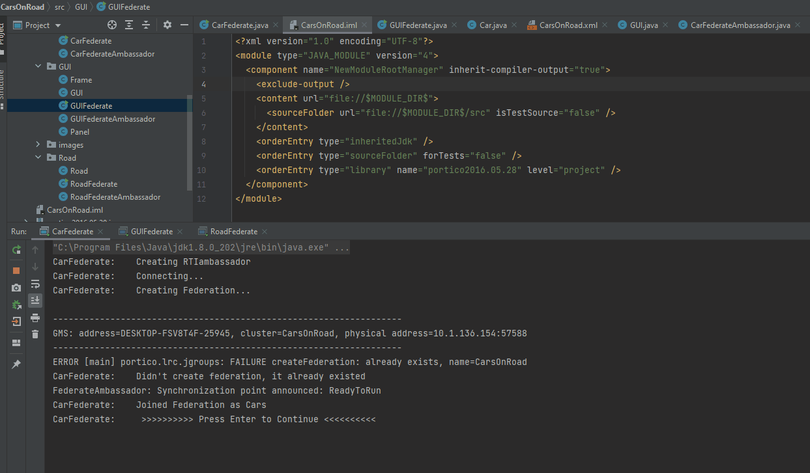

# Cars on road simulation in HLA architecture

## Table of contents
* [General info](#general-info)
* [Usage](#usage)

## General info
The project was based on Portico:  
https://porticoproject.org/  
https://github.com/openlvc/portico  

The project contains an implementation of a simulator of a road traversed by columns of cars in HLA architecture. The number of cars in the column during the passage and their speed is randomized. Average time of covering the route by the whole column is calculated.
	
## Usage
The final result:

